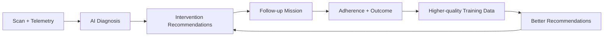
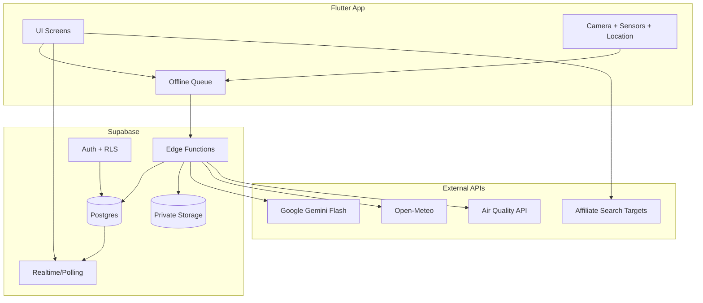
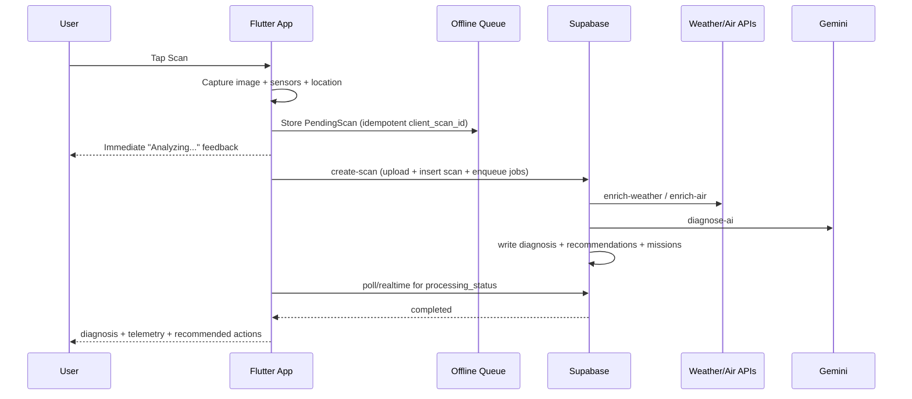
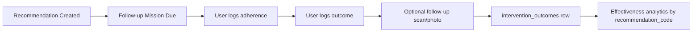
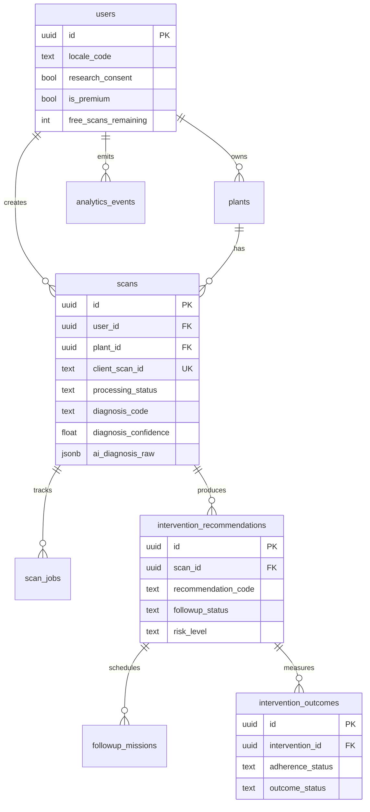
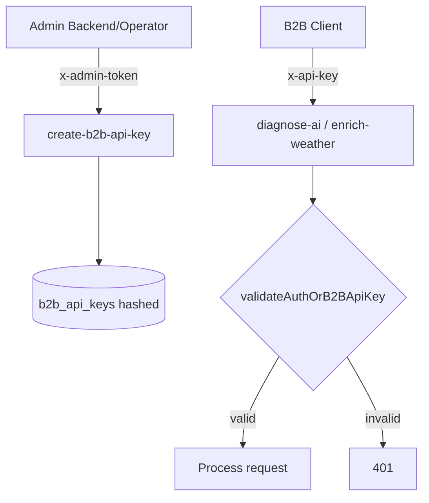

# FloraScan

Production-grade Flutter + Supabase plant intelligence platform with:

- Offline-first scan pipeline
- AI diagnosis + treatment recommendations
- Recovery loop tracking (intervention -> adherence -> outcome)
- Affiliate commerce intent links
- Freemium paywall and premium assistant
- B2B API key authentication path for enterprise ingestion

## Table of Contents

- [1. Product Overview](#1-product-overview)
- [2. System Architecture](#2-system-architecture)
- [3. Core User Flows](#3-core-user-flows)
- [4. Screens and Routes](#4-screens-and-routes)
- [5. Data Model (Golden Record + Recovery Loop)](#5-data-model-golden-record--recovery-loop)
- [6. Edge Functions](#6-edge-functions)
- [7. Monetization and Enterprise Layers](#7-monetization-and-enterprise-layers)
- [8. Local Development Setup](#8-local-development-setup)
- [9. Supabase Setup and Deployment](#9-supabase-setup-and-deployment)
- [10. Testing and Validation](#10-testing-and-validation)
- [11. Project Structure](#11-project-structure)
- [12. Security and Privacy](#12-security-and-privacy)

## 1. Product Overview

FloraScan is designed as a consumer app and a data engine at the same time.

- Consumer value: fast diagnosis, actionable recommendations, assistant chat, polished UX.
- Data value: high-quality longitudinal records for future model training.
- Business value: freemium conversion, affiliate intent monetization, B2B telemetry API path.

### North-Star Loop



## 2. System Architecture



## 3. Core User Flows

### 3.1 Zero-Latency Scan Pipeline



### 3.2 Recovery Intelligence Loop



## 4. Screens and Routes

Current route map (`go_router`):

| Route | Screen | Purpose |
|---|---|---|
| `/login` | Login | Auth entry (bypassed when `APP_TEST_MODE=true`) |
| `/` | Home | Plant list, premium/free state, weekly snapshot |
| `/scan` | Scan | Camera capture + deep analysis toggle + paywall |
| `/scan-history` | Scan History | Past scans |
| `/plant/add` | Add Plant | Plant registration |
| `/plant/:id` | Plant Detail | Plant profile and timeline |
| `/diagnosis/:scanId` | Diagnosis Result | AI diagnosis, telemetry, recommendations, outcomes |
| `/assistant` | Chat Assistant | Premium-only conversational care assistant |
| `/settings` | Settings | Locale, consent, sync metadata |

Navigation shell tabs: `Plants`, `Scan`, `History`, `Settings`.

## 5. Data Model (Golden Record + Recovery Loop)

Supabase schema lives in [schema.sql](supabase/schema.sql).



## 6. Edge Functions

Implemented under `supabase/functions`:

- `create-scan`: idempotent scan creation + async job enqueue
- `enrich-weather`: Open-Meteo enrichment + VPD derivation
- `enrich-air`: AQ enrichment
- `diagnose-ai`: Gemini diagnosis + recommendations + commerce links + missions
- `submit-intervention-outcome`: adherence/outcome capture + mission completion
- `care-chat`: contextual assistant responses
- `log-analytics-event`: telemetry event ingestion
- `create-b2b-api-key`: admin-protected B2B key issuance

## 7. Monetization and Enterprise Layers

### 7.1 Freemium Gating

- Basic scan capture and telemetry remain accessible.
- Deep AI analysis and assistant are premium-gated.
- Paywall interactions are tracked in `analytics_events`.

### 7.2 Affiliate Commerce Intent Layer

- `diagnose-ai` returns `treatment_plan.commerce_links`.
- UI renders `Buy Treatment Now` CTA in diagnosis screen.
- Links are sanitized and tracked.

### 7.3 B2B API Key Flow



## 8. Local Development Setup

### 8.1 Prerequisites

- Flutter SDK (stable)
- Dart SDK (bundled with Flutter)
- Supabase project
- Optional: Supabase CLI

### 8.2 Install dependencies

```bash
flutter pub get
```

### 8.3 Run app

Production-like auth:

```bash
flutter run -d chrome \
  --dart-define=SUPABASE_URL=https://YOUR_PROJECT.supabase.co \
  --dart-define=SUPABASE_ANON_KEY=YOUR_ANON_KEY
```

Testing mode (bypass login gate):

```bash
flutter run -d chrome \
  --dart-define=SUPABASE_URL=https://YOUR_PROJECT.supabase.co \
  --dart-define=SUPABASE_ANON_KEY=YOUR_ANON_KEY \
  --dart-define=APP_TEST_MODE=true
```

### 8.4 Optional payment envs

```bash
--dart-define=DODO_CHECKOUT_BASE_URL=https://checkout.dodopayments.com/...
--dart-define=DODO_SUCCESS_URL=https://your-webapp.com/?payment=success
--dart-define=DODO_CANCEL_URL=https://your-webapp.com/?payment=cancel
```

## 9. Supabase Setup and Deployment

### 9.1 Apply schema

Run [schema.sql](supabase/schema.sql) in Supabase SQL editor.

### 9.2 Configure secrets (Edge Functions)

Required secrets:

- `SUPABASE_URL`
- `SUPABASE_ANON_KEY`
- `SUPABASE_SERVICE_ROLE_KEY`
- `GEMINI_API_KEY`
- `B2B_ADMIN_TOKEN` (for key creation endpoint)

### 9.3 Deploy functions

```bash
supabase functions deploy create-scan
supabase functions deploy enrich-weather
supabase functions deploy enrich-air
supabase functions deploy diagnose-ai
supabase functions deploy submit-intervention-outcome
supabase functions deploy care-chat
supabase functions deploy log-analytics-event
supabase functions deploy create-b2b-api-key
```

### 9.4 Issue a B2B API key (example)

```bash
curl -X POST "https://YOUR_PROJECT.supabase.co/functions/v1/create-b2b-api-key" \
  -H "Content-Type: application/json" \
  -H "x-admin-token: YOUR_B2B_ADMIN_TOKEN" \
  -d '{"company_name":"Acme Agri","tier_limit":10000}'
```

## 10. Testing and Validation

Run unit/widget tests:

```bash
flutter test
```

Suggested release checks:

- Scan in offline mode -> reconnect -> verify sync
- Confirm `client_scan_id` idempotency on repeated uploads
- Verify diagnosis, recommendations, missions created
- Submit outcome and confirm mission transitions to `completed`
- Validate premium gates and paywall analytics events
- Validate `x-api-key` path for enterprise endpoints

## 11. Project Structure

```text
lib/
  config/          # app config, theme, router
  l10n/            # localization (.arb + generated delegates)
  models/          # typed data models
  providers/       # Riverpod state providers/notifiers
  screens/         # UI routes
  services/        # pipeline, Supabase, sensors, notifications, payments
  utils/           # image/geohash/telemetry helpers
  widgets/         # reusable UI components

supabase/
  schema.sql
  functions/
    _shared/       # CORS, security, B2B auth, hash helpers
    create-scan/
    enrich-weather/
    enrich-air/
    diagnose-ai/
    care-chat/
    submit-intervention-outcome/
    log-analytics-event/
    create-b2b-api-key/
```

## 12. Security and Privacy

- Private storage bucket for scan images
- RLS across user-owned tables
- EXIF stripping before upload
- Consent-aware geolocation persistence (rounded vs precise)
- Canonical code storage for language-neutral analytics
- Input validation and auth checks in edge functions

---

If you want, the next documentation pass can add:

- Embedded app screenshots/GIF walkthroughs
- API request/response examples per function
- ERD synced to exact schema constraints
